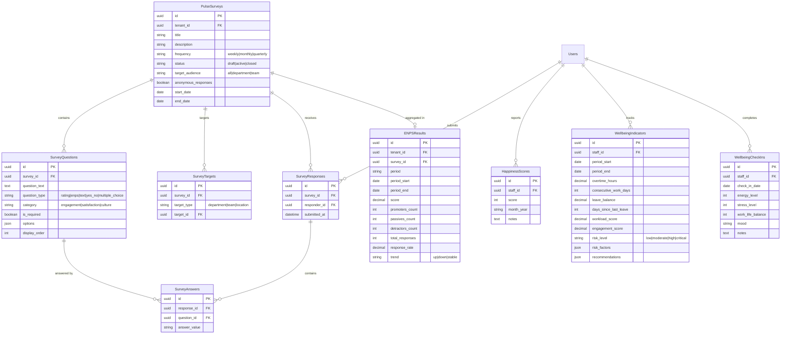
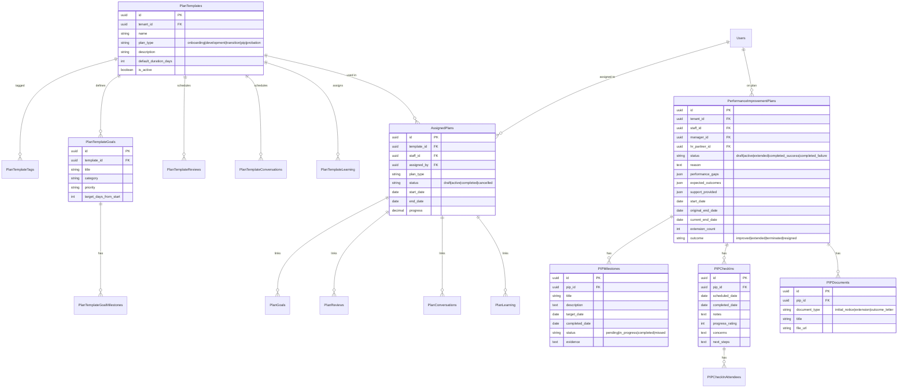

# Performance Management Module - Entity Relationship Diagrams

## Overview

This document provides visual ERD representations for the Performance Management Module database schema, organized by microservice boundaries.

**Schema Legend:**
- 🔵 **Core** - Shared tenant/user data
- 🟢 **Goals** - OKRs and Goals
- 🟣 **Reviews** - Performance reviews and calibration
- 🟠 **Feedback** - 360° feedback and recognition
- 🔴 **LMS** - Learning management
- 🟡 **Talent** - Skills, career pathing, succession
- 🩵 **Engagement** - Surveys and wellbeing
- 💰 **Compensation** - Salary and merit
- 📋 **Plans** - Development plans and templates
- ⚠️ **PIP** - Performance improvement plans
- 💬 **Activities** - Conversations and 1:1s
- ✅ **Tasks** - Performance tasks and pipelines
- 🤝 **Mentorship** - Mentor matching
- 💵 **Budget** - Development budget tracking

---

## High-Level Service Architecture

---

## 1. Core Service ERD

---

## 2. Goals & OKR Service ERD

---

## 3. Reviews Service ERD

---

## 4. Feedback Service ERD (360° & Recognition)

---

## 5. LMS Service ERD

---

## 6. Talent Service ERD (Skills, Career, 9-Box, Succession)

---

## 7. Engagement Service ERD

---

## 8. Compensation Service ERD

---

## 9. Plans & PIP Service ERD

---

## 10. Activities, Tasks & Mentorship ERD

---

## 11. Budget & Audit Service ERD

---

## Cross-Service Relationships Overview

---

## Table Count Summary

| Schema | Table Count | Description |
|--------|-------------|-------------|
| core | 7 | Tenants, Users, Departments, Locations, Teams, TeamMembers, UserRoles |
| goals | 5 | OKRCycles, Objectives, KeyResults, KeyResultUpdates, Goals, GoalMilestones, GoalCategories |
| reviews | 6 | ReviewCycles, ReviewCriteriaTemplates, ReviewCriteriaItems, PerformanceReviews, ReviewRatings, CalibrationSessions, CalibrationParticipants, CalibrationRatings |
| feedback | 12 | Competencies, Feedback360Requests, Feedback360Responses, Feedback360Ratings, PeerNominations, Feedback, CultureValues, PraisePosts, PraiseBadges, PraiseLikes, PraiseComments, RecognitionPointsLedger, RewardsCatalog, RewardRedemptions |
| lms | 20 | CourseCategories, Courses, CoursePrerequisites, CourseSkills, CourseTags, CourseModules, ModuleContent, Assessments, AssessmentQuestions, LearningPaths, LearningPathCourses, LearningPathTags, Enrollments, ModuleProgress, ContentProgress, AssessmentAttempts, Certificates, LearningPathEnrollments, CourseReviews, LearningStreaks, DailyActivity, Achievements, EarnedAchievements |
| talent | 11 | Skills, StaffSkills, SkillCertifications, CareerPaths, CareerLevels, CareerLevelSkills, StaffCareerProgress, TalentAssessments, KeyRoles, SuccessionCandidates, SuccessionCompetencyGaps, DevelopmentActions |
| engagement | 8 | PulseSurveys, SurveyTargets, SurveyQuestions, SurveyResponses, SurveyAnswers, ENPSResults, HappinessScores, WellbeingIndicators, WellbeingCheckIns |
| compensation | 7 | SalaryBands, EmployeeCompensation, MeritCycles, MeritBudgets, MeritAllocations, BonusPrograms, BonusCriteria, BonusAllocations |
| plans | 11 | PlanTemplates, PlanTemplateTags, PlanTemplateGoals, PlanTemplateGoalMilestones, PlanTemplateReviews, PlanTemplateConversations, PlanTemplateLearning, AssignedPlans, PlanGoals, PlanReviews, PlanConversations, PlanLearning |
| pip | 5 | PerformanceImprovementPlans, PIPMilestones, PIPCheckIns, PIPCheckInAttendees, PIPDocuments |
| activities | 3 | Conversations, ConversationNotes, ConversationActionItems |
| tasks | 6 | Pipelines, PipelineStages, CustomTaskTypes, PerformanceTasks, TaskComments, TaskAttachments, TaskActivityLog |
| mentorship | 4 | MentorProfiles, MenteeProfiles, MentorshipMatches, MentorshipMeetings |
| budget | 2 | DevelopmentBudgets, BudgetRequests |
| audit | 1 | AuditLog |
| notifications | 2 | Notifications, NotificationPreferences |

**Total: ~100+ tables across 16 schemas**

---

## Notes

1. **Multi-Tenancy**: All tables include `tenant_id` for data isolation
2. **Soft Deletes**: Most tables support `is_deleted` flag
3. **Audit Trail**: Standard `created_at`, `updated_at` columns
4. **Foreign Keys**: Enforce referential integrity within tenant boundaries
5. **Indexes**: Optimized for common query patterns (tenant + entity lookups)
